# 流水线样例

阿里云上配置cicd流水线，把一个React + Springboot的前后端分离服务部署到阿里ACK环境。

## 待完善项目
- [ ] 加速Maven build速度。配置镜像
- [ ] 分离build jar包和docker image步骤
- [ ] 前端独立部署
- [ ] 增加对数据库的使用
- [ ] Jenkins改用工作节点build
- [ ] 增加前后端单元测试样例
- [ ] 使用Helm参数化k8s部署
- [ ] 改用ACK专用版（？）

## 配置Jenkins ECS
### 申请ECS实例
可以使用现有实例，如果没有可以申请一台。
例子中使用的操作系统是 Alibaba Cloud Linux  3.2104 64位。如果使用的是其它操作系统，操作可能略有区别。

### 安装Jenkins
[官方参考文档](https://www.jenkins.io/doc/book/installing/)
Jenkins有多种安装方式，本次样例采用在宿主机Linux环境直接安装。

``` bash
# 配置yum源
sudo wget -O /etc/yum.repos.d/jenkins.repo \
    https://pkg.jenkins.io/redhat-stable/jenkins.repo
sudo rpm --import https://pkg.jenkins.io/redhat-stable/jenkins.io.key
sudo yum upgrade
sudo systemctl daemon-reload
# 安装
sudo yum install jenkins java-11-openjdk-devel
```

### 安装Git Docker
``` bash
sudo yum install git
```
这里有两个选择，使用阿里云dnf版或社区版。本样例使用样例版。
参考： https://help.aliyun.com/document_detail/264695.html
#### 安装dnf默认版。
``` bash
dnf -y install docker
```
注意如果安装dnf版，没有守护进程。不需要systemctl 启动或者停止docker。

#### 安装社区版
``` bash
# Ali linux3 需要用这个改写地址。 参考 https://help.aliyun.com/knowledge_detail/257767.html
dnf install dnf-plugin-releasever-adapter --repo alinux3-plus

sudo yum install -y \
    yum-utils \
    device-mapper-persistent-data \
    lvm2

sudo yum-config-manager \
    --add-repo \
    https://mirrors.aliyun.com/docker-ce/linux/centos/docker-ce.repo

Def install docker-ce
```

配置阿里云Docker镜像。镜像地址可以在阿里云账号的镜像服务中查到。使用内网地址避免产生外网流量。
创建 `/etc/docker/daemon.json`
``` json
{
  "registry-mirrors": ["https://registry-vpc.cn-shanghai.aliyuncs.com"]
}
```

确保Jenkins用户可以使用docker
``` bash
sudo usermod -a -G docker jenkins
```

启动Docker
``` bash
sudo systemctl start docker
```

### 启动Jenkins
``` bash
sudo systemctl start jenkins
```

### 配置Jenkins
#### 在ECS安全规则中添加规则，开启8080端口

#### 本地浏览器打开Jenkins 页面 http://<ECS_public_ip>:8080

#### 解锁Jenkins，按照页面提示，把初始密码填入页面
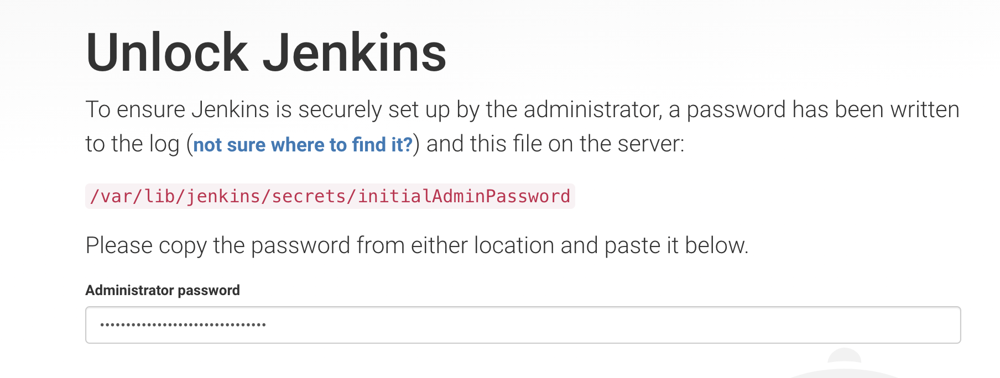

#### 安装建议的Plugin

#### 创建用户名密码


## 创建ACK集群
选择ACK托管版，大部分选项保留默认。专业网络、虚拟交换机不存在的话需要创建。
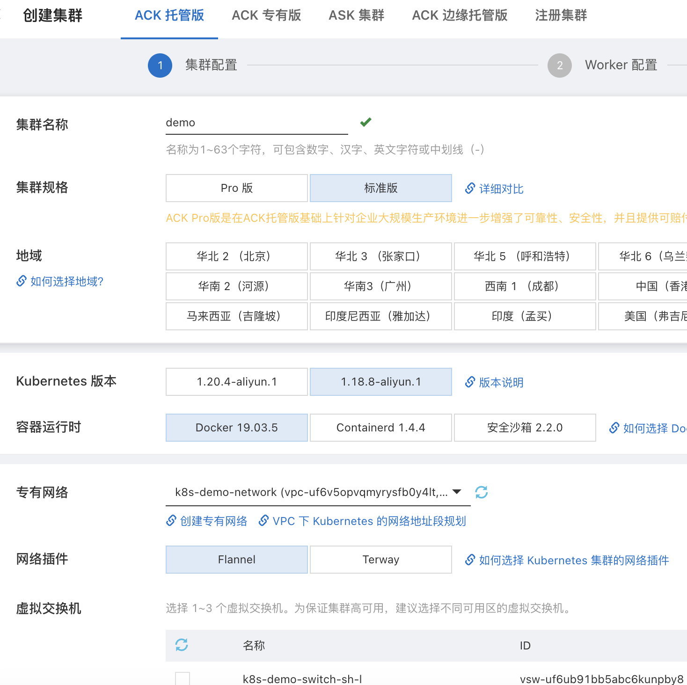

注意设置以下值：
* kubernetes版本： 1.18.8-aliyun.1
* SNAT：如果确定生产环境无需公网可以去掉
* 使用EIP暴露API Server：不选的话，Jenkins ECS必须与k8s集群在同一内网中。如果选择可以从公网任何机器通过API操作k8s

创建Worker实例，或者选择已有的ECS。
**注意：把现有ECS加入集群会清空ECS硬盘。**
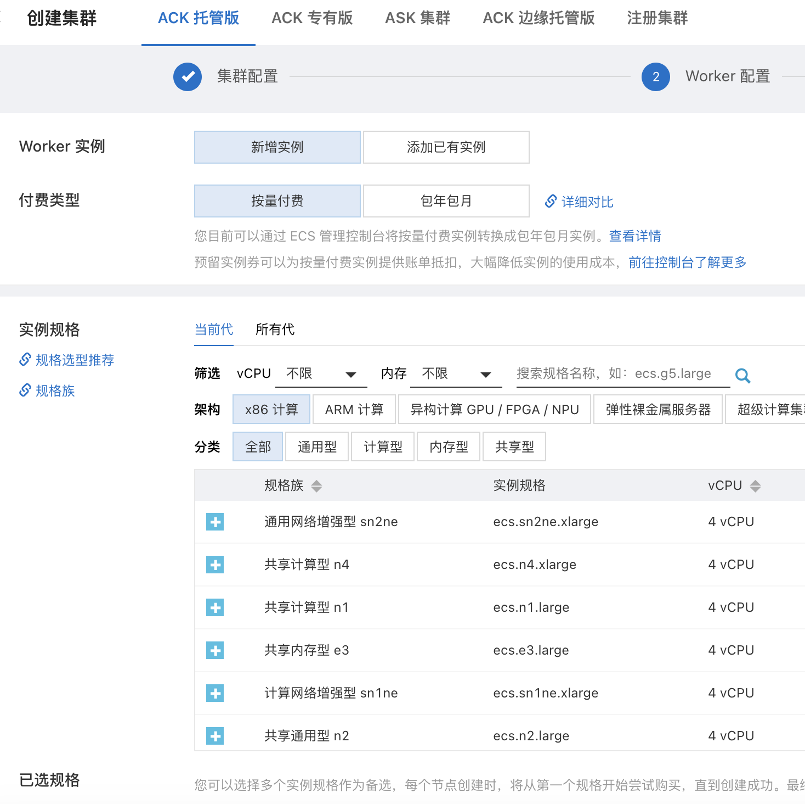
密钥对如果不存在需要创建一个。

组件配置，保留默认值。
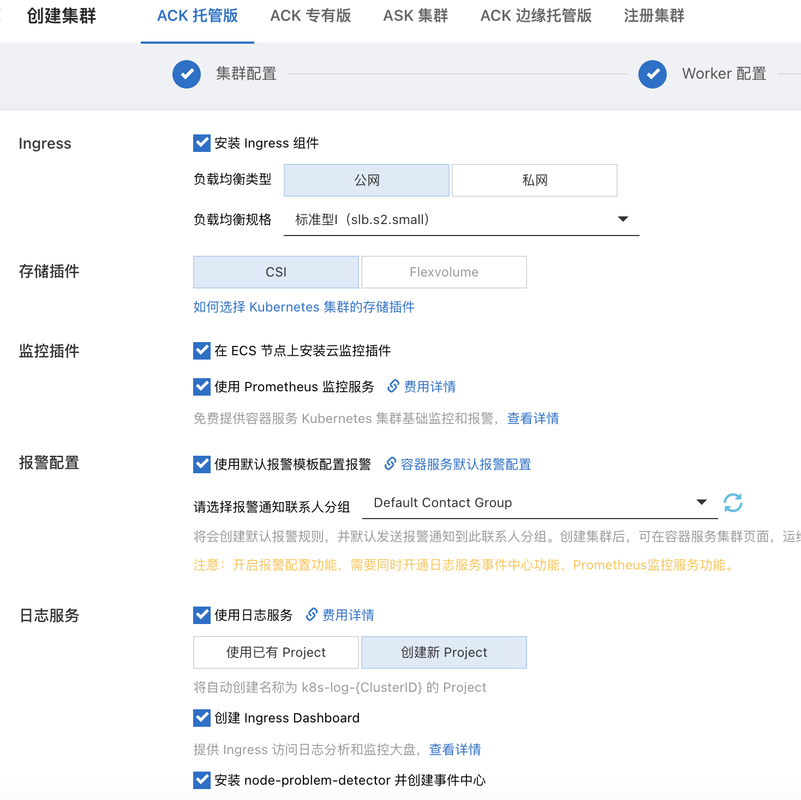

确认配置后，创建集群。等待集群创建成功。

### ACK dashboard
创建成功后可以看到集群dashboard。有一些预先配置的管理应用已经安装成功。
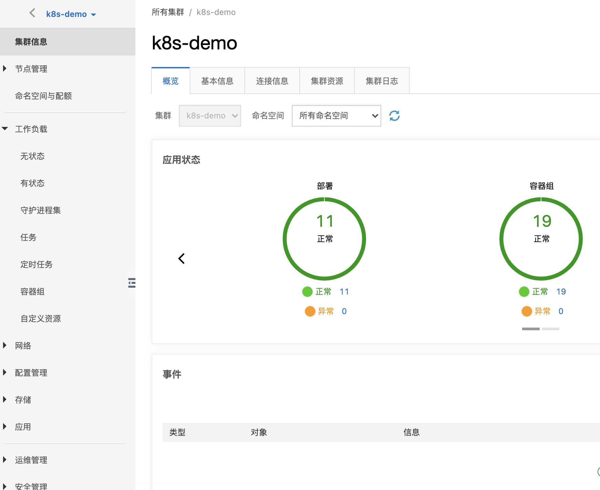
错误排查：出现 CSI provider启动不成功的情况时，把pod数设置为1

### 配置Jenkins 与 k8s连接
在Jenkins ECS上安装kubectl
``` bash
curl -LO "https://dl.k8s.io/release/v1.18.8/bin/linux/amd64/kubectl"
sudo install -o root -g root -m 0755 kubectl /usr/local/bin/kubectl
```
更新 ~/.kube/config 文件。把集群信息->连接信息中的内容粘贴进去。
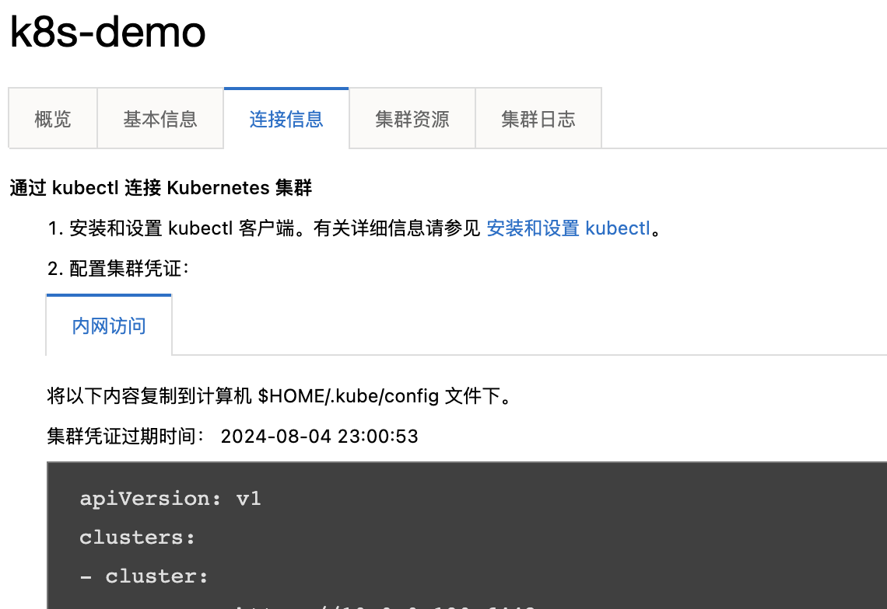

验证与集群的连接。
``` bash
kubectl version
```
如果正常显示server和客户端的版本号表明连接成功。
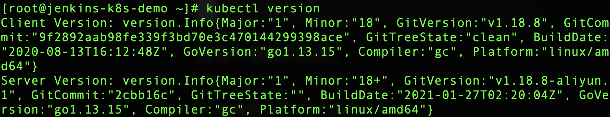

### 为ACK集群生成docker 仓库密码
如果还未开通容器镜像服务，在阿里云工作台开通。设置固定密码。创建命名空间。
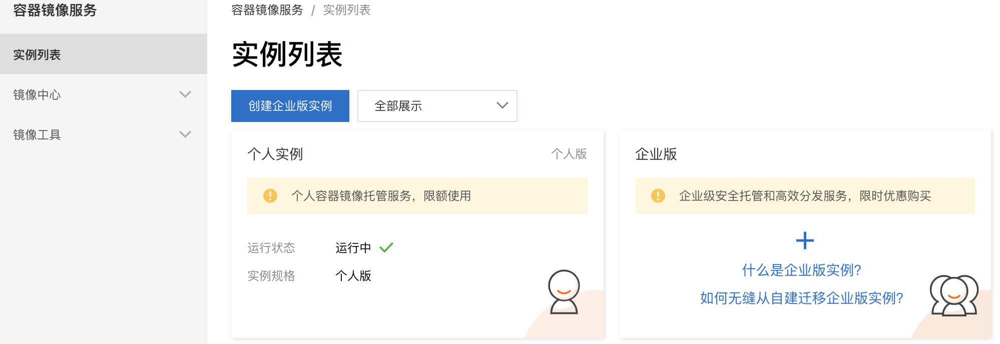
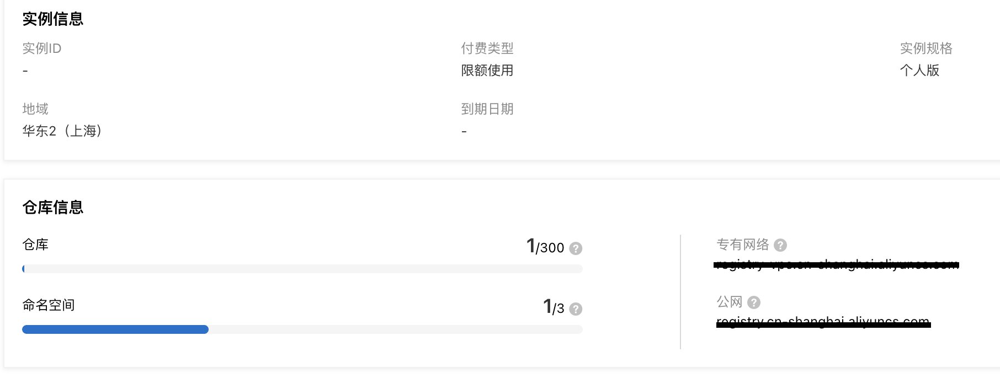
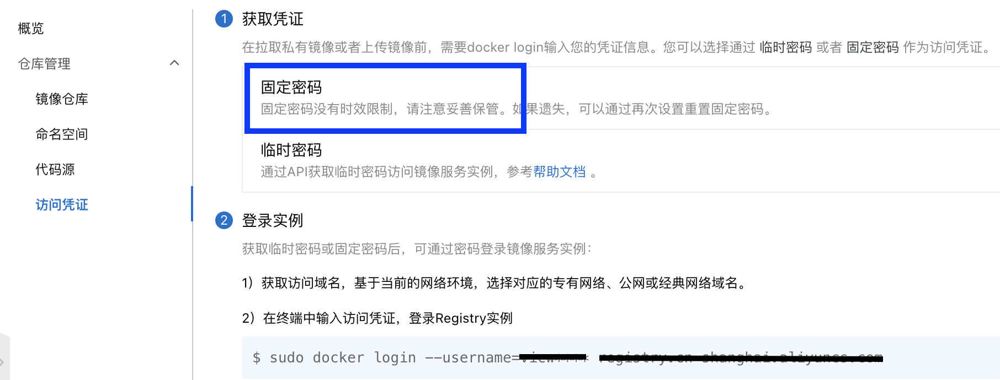

在Jenkins ECS执行命令。把镜像仓库信息写入k8s
``` base
kubectl -n=demo create secret docker-registry ali-registry --docker-server=<专有网络地址> --docker-username=<阿里云账户名> --docker-password=<固定密码>
```
注意：是容器服务的固定密码，不是阿里云密码。

## 创建pipeline

### 在Jenkins中设置凭证

#### 设置git hub credentials
在Manage Jenkins, Credentials中设置全局凭证。也可以在后面创建pipeline时创建project级别的凭证。
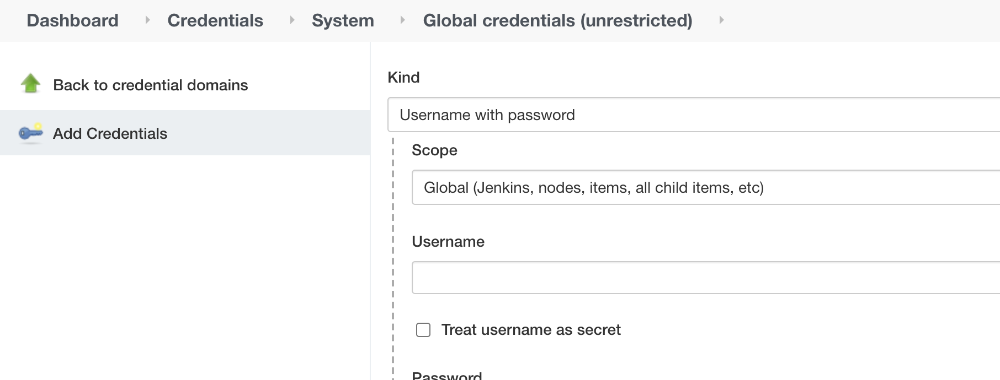

- 凭据设置为：用户名是Github登录用户名。密码为token，[token创建见连接说明](https://github.com/settings/tokens)，token的权限只要在`repo`即可。注意：token不能包含空格，拷贝的时候注意。

#### 设置镜像服务凭证
- 为镜像服务再创建一个凭证，命名为`docker-login` (与Jenkins file内容一致)
- 凭证设置为：用户名是阿里云账户，密码为容器服务固定密码 

#### 设置k8s连接信息
- 把前面ACK集群连接信息页面中的连接信息保存到一个本地文件。
- 为k8s连接创建一个secret file类型凭证，命名为 `kubectl.config`。上传本地文件。

### 添加新pipeline

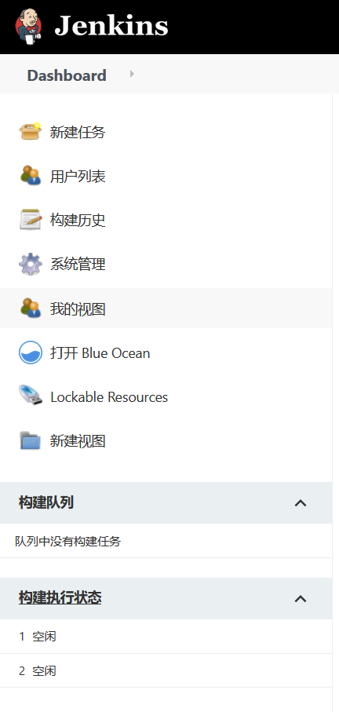

点击New Item >> Multibranch Pipeline

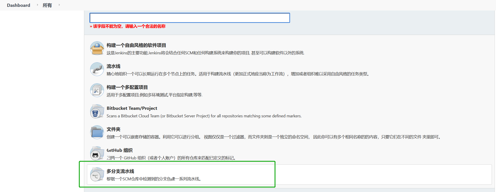
设置github地址，选择前面创建的凭证。

#### 设置jenkins-pr

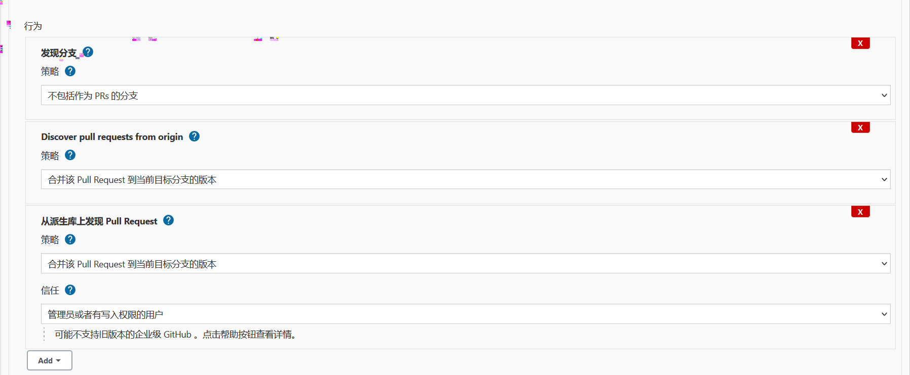

这里选择`仅仅具有拉取请求的分支`

#### Jenkinsfile

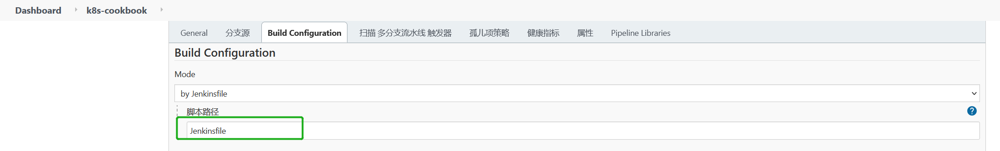

如图，build configuration，是指使用哪个脚本文件来指示jenkins进行流水线build作业。默认是扫描branch分支下的`Jenkinsfile`文件。所以仓库中的Jenkinsfile必须要存在

上面设置完成之后，点击`保存`保存配置。
如果配置正常，Jenkins会扫描仓库，发现分支或者PR，进行构建。

#### 设置Git hook自动触发流水线
在Github Repo UI >> Settings

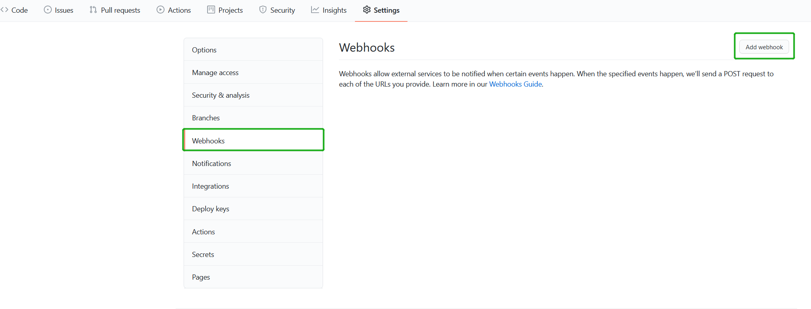

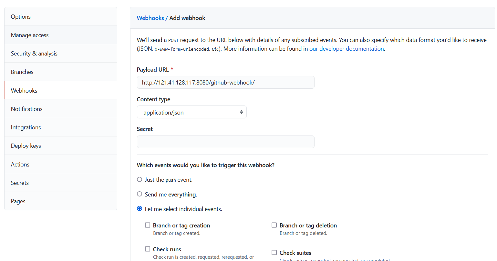

- 在这里，payload url：jenkins host url + /github-webhook/，如图所示，`http://121.41.128.117:8080` 应该设置成jenkins地址
- 如果是仅仅希望在push代码到仓库的时候，触发jenkins构建管道，那么选择第一项，如果要定制何时何种event触发构建管道，选择第三项，然后手动选择具体的event
- 点击`Add webhook`保存webhook


可以点击上面的webhook url进行测试，默认会获取最近一次的delivery，如果webhook没有生效，点击该链接同样可以知晓具体原因。


